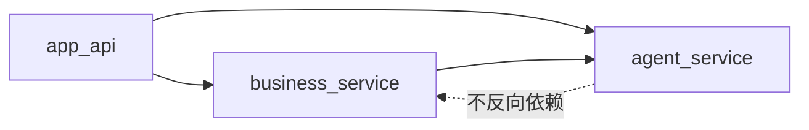
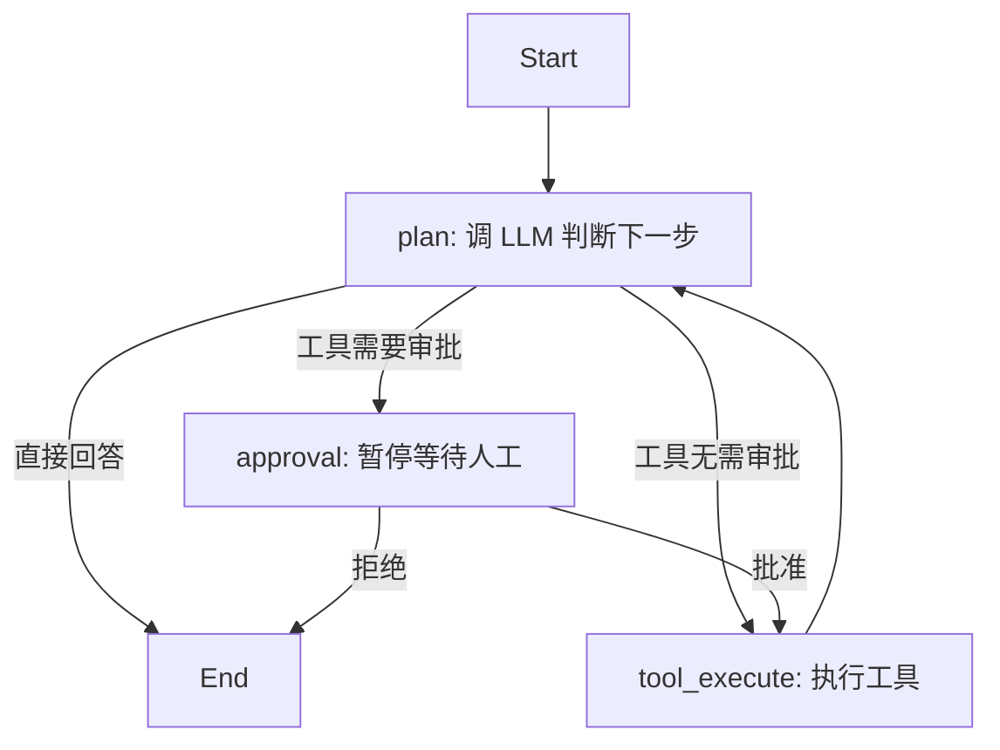

# 从零读懂这个 Agent 售后项目

这篇文档给 0 基础或接近 0 基础的学习者看。你不需要一开始就懂 FastAPI、SQLAlchemy、LangGraph、tool calling、checkpoint 或 Agent 架构。

你只需要按人的自然理解顺序来：

```text
先看到系统能做什么
  -> 再调用几个接口
  -> 再追踪一次请求经过哪些文件
  -> 最后才下钻到 LangGraph、数据库、状态恢复这些底层细节
```

不要从 `src/agent_service/conversation/nodes.py` 开始读。那是比较底层的流程节点，第一次看会很吃力。

这个项目可以先理解成：

> 一个“售后客服 Agent 后端”。用户可以用自然语言查订单、查物流、建工单、申请退款。如果退款风险较高，系统会暂停，等待人工审批后再继续执行。

学完这篇文档，你应该能说清楚：

1. 一个 HTTP 请求从哪里进入项目。
2. 普通后端 API 和 Agent API 有什么区别。
3. Agent 如何把用户一句话变成一次工具调用。
4. 为什么高风险退款要暂停，审批后再恢复。
5. 为什么项目要拆成 `app_api`、`business_service.after_sales`、`agent_service`。

---

## 0. 这份文档的正确打开方式

这个项目不能按“目录从上到下”读，也不能按“底层到上层”读。

对新手来说，最舒服的顺序是：

```text
第 1 层：用户能看到的东西
  Swagger、curl、JSON、SSE 事件

第 2 层：API 入口
  FastAPI router、请求模型、响应模型

第 3 层：售后业务
  订单、物流、工单、退款、审批、审计日志

第 4 层：Agent 运行时
  LLM、tool calling、LangGraph、状态存储、暂停恢复

第 5 层：数据库和测试
  表结构、仓储、种子数据、端到端测试
```

这叫从上层往下层读。先看结果，再看入口，再看业务，再看 Agent 内部。

如果你第一次学习，先不要纠结这些问题：

- LangGraph 的每个节点怎么实现。
- SQLAlchemy 的每个字段为什么这样写。
- checkpoint 具体怎么存。
- LLM client 怎么重试。
- 为什么某个类用 dataclass，某个类用 Pydantic。

这些都放到后半部分。前面先建立“请求链路”的感觉。

---

## 1. 先用一句话认识三层架构

这个项目有三块主代码：

| 目录 | 生活化比喻 | 新手先记住 |
| --- | --- | --- |
| `src/app_api` | 门口接待员 | 接 HTTP 请求，把请求交给合适的人 |
| `src/business_service/after_sales` | 售后业务办公室 | 真正懂订单、物流、退款、审批规则 |
| `src/agent_service` | 通用 Agent 发动机 | 不懂售后，只负责让 LLM、工具、流程跑起来 |

最重要的设计点：

```text
agent_service 不依赖 business_service.after_sales
```

也就是说，`agent_service` 这个 Agent 发动机不知道什么是订单、退款、工单。售后业务层把自己的能力包装成 `AgentCapability`，交给 Agent 发动机运行。

依赖方向大致是：



这不是假隔离。代码里 `agent_service` 只依赖自己的 contracts、conversation、tools、llm、state_store 等模块，不 import 售后业务。

---

## 2. 第一步：先把系统跑起来

进入项目根目录：

```bash
cd /home/zhouhangmyers/python/agent-orchestrator-platform
```

安装依赖：

```bash
uv sync --extra dev
```

写入演示数据：

```bash
make seed
```

启动后端：

```bash
make start
```

打开浏览器：

```text
http://127.0.0.1:8000/docs
```

这个页面叫 Swagger UI。你可以把它理解成“后端接口菜单”。

### 2.1 最小环境变量

本地学习时，最小配置类似：

```env
APP_ENV=dev
BUSINESS_DATABASE_URL=sqlite+pysqlite:///./after_sales_mvp.db
AUTO_CREATE_SCHEMA=true

LLM_PROVIDER=deepseek
LLM_MODEL=deepseek-chat
DEEPSEEK_API_KEY=your_deepseek_api_key

# 可选
API_KEY=
AGENT_RUNTIME_DATABASE_URL=
LLM_TIMEOUT_SECONDS=5
LLM_MAX_RETRIES=1
MAX_STEPS=4
APPROVAL_TIMEOUT_SECONDS=900
```

先只记住两个数据库变量：

- `BUSINESS_DATABASE_URL`：业务数据库，存订单、物流、工单、退款、审批、审计日志。
- `AGENT_RUNTIME_DATABASE_URL`：Agent 运行状态数据库，存 LangGraph checkpoint。不填时，本地开发使用内存版 state store。

如果你设置了 `API_KEY`，所有业务接口都要带请求头：

```bash
-H "X-API-Key: your_api_key"
```

如果没有设置 `API_KEY`，本地开发可以不传这个 header。

### 2.2 健康检查

先调用：

```bash
curl http://127.0.0.1:8000/health
```

正常结构类似：

```json
{
  "status": "ok",
  "runtime_store": {
    "ok": true,
    "backend": "in-memory",
    "detail": null
  },
  "business_database": {
    "ok": true,
    "schema_ready": true,
    "detail": null
  },
  "llm": {
    "ok": true,
    "provider": "deepseek",
    "model": "deepseek-chat",
    "detail": null
  }
}
```

如果 `status` 是 `degraded`，意思不是后端挂了，而是某个依赖不完整。常见原因是没有 LLM API key，或者数据库 schema 没准备好。

再运行：

```bash
make doctor
```

`doctor` 会检查 runtime store、business database、LLM 配置和可疑环境变量。

### 2.3 这一阶段你先看哪些文件

只看这几个：

```text
Makefile
src/app_api/main.py
src/app_api/settings.py
src/app_api/routers/health.py
src/app_api/bootstrap.py
```

你现在只需要知道：

- `main.py` 创建 FastAPI app。
- `settings.py` 读取环境变量。
- `health.py` 提供 `/health`。
- `bootstrap.py` 负责把数据库、LLM、业务服务、Agent engine 装配起来。

先不要看 `agent_service/conversation`。

---

## 3. 第二步：先学普通后端 API

现在先不要碰 Agent。先理解普通资源接口。

这些接口不需要 LLM，也不需要 LangGraph。它们只是读写业务数据库。

### 3.1 查询订单

```bash
curl http://127.0.0.1:8000/api/after-sales/orders/ORD123
```

你应该能看到订单状态、金额、商品摘要等字段。

这条请求的上层到下层路径是：

```text
浏览器 / curl
  -> src/app_api/routers/after_sales_resources.py
  -> repository.get_order()
  -> business DB: orders 表
  -> JSON 响应
```

对应文件：

```text
src/app_api/routers/after_sales_resources.py
src/business_service/after_sales/infrastructure/persistence/sqlalchemy/repositories.py
src/business_service/after_sales/infrastructure/persistence/sqlalchemy/models.py
```

注意这个阶段的重点：

> 普通查单不需要 Agent。因为你已经明确知道要查 `ORD123`。

### 3.2 查询物流

```bash
curl http://127.0.0.1:8000/api/after-sales/orders/ORD123/shipment
```

这会查 `shipments` 表对应的物流信息。

### 3.3 查询客户

```bash
curl http://127.0.0.1:8000/api/after-sales/customers/CUS001
```

### 3.4 搜索售后规则

```bash
curl "http://127.0.0.1:8000/api/after-sales/policies/search?q=退款"
```

### 3.5 创建工单

```bash
curl -X POST http://127.0.0.1:8000/api/after-sales/tickets \
  -H "Content-Type: application/json" \
  -d '{
    "order_id": "ORD123",
    "issue_type": "damaged",
    "summary": "耳机收到后破损，需要售后处理",
    "priority": "normal"
  }'
```

### 3.6 直接创建退款申请

```bash
curl -X POST http://127.0.0.1:8000/api/after-sales/refund-requests \
  -H "Content-Type: application/json" \
  -d '{
    "order_id": "ORD123",
    "amount": "50",
    "reason": "普通退款申请",
    "requires_approval": false
  }'
```

这也是普通资源接口，不经过 Agent 的自然语言判断。

### 3.7 这一阶段的验收问题

你应该能回答：

1. 为什么 `GET /orders/ORD123` 不需要 LLM？
2. `after_sales_resources.py` 做了什么？
3. repository 做了什么？
4. 如果订单不存在，404 是在哪一层返回的？
5. 普通资源接口和 Agent 接口有什么区别？

如果这些问题还答不上来，先不要进入 LangGraph。

---

## 4. 第三步：第一次调用 Agent

现在再看 Agent 接口。

让 Agent 查订单：

```bash
curl -X POST http://127.0.0.1:8000/api/after-sales/runs \
  -H "Content-Type: application/json" \
  -d '{
    "message": "查一下订单 ORD123",
    "session_id": "guide-session-1",
    "actor_id": "learner-1"
  }'
```

你会得到类似结构：

```json
{
  "run_id": "run-xxxxxxxx-xxxx-xxxx-xxxx-xxxxxxxxxxxx",
  "session_id": "guide-session-1",
  "status": "completed",
  "output": "订单 ORD123 当前状态是 shipped，商品为 蓝牙耳机 x1。",
  "pending_action": null,
  "error": null
}
```

注意：

- `message` 是用户自然语言。
- `session_id` 是一段聊天会话的 ID，可以由调用方传入。
- `run_id` 是这一次执行的 ID，由后端生成，不能手写固定值假装它存在。
- `status=completed` 表示这次 run 正常完成。

这条请求的上层到下层路径是：

```text
POST /api/after-sales/runs
  -> after_sales_runs.py
  -> AfterSalesAssistantService.run()
  -> WorkflowEngine.stream_run()
  -> ConversationService / ConversationGraph
  -> LLM 判断要调用 get_order_detail
  -> InlineToolExecutor 执行工具
  -> 售后 capability 里的 get_order_detail handler
  -> repository.get_order()
  -> 返回工具结果
  -> LLM 组织最终中文回答
  -> RunResponse
```

第一次读代码时，按这个顺序读：

```text
1. src/app_api/routers/after_sales_runs.py
2. src/app_api/schemas/runs.py
3. src/business_service/after_sales/application/services/assistant_service.py
4. src/business_service/after_sales/application/capability/capability.py
5. src/agent_service/infrastructure/workflow/workflow_engine.py
```

现在仍然不要深入 `nodes.py`。你先知道 `WorkflowEngine` 后面会进入 Agent 运行时就够了。

---

## 5. 第四步：理解 tool calling

Agent 不会直接查数据库。它只是会决定“要不要调用某个工具”。

售后业务层把 6 个动作交给 Agent：

| 工具名 | 作用 |
| --- | --- |
| `get_order_detail` | 查订单 |
| `get_shipment_detail` | 查物流 |
| `create_ticket` | 建售后工单 |
| `get_ticket_detail` | 查工单 |
| `submit_refund_request` | 提交退款申请 |
| `search_after_sales_policy` | 搜索售后政策 |

这些动作定义在：

```text
src/business_service/after_sales/application/capability/capability.py
```

新手可以这样理解 tool calling：

```text
用户说：查一下订单 ORD123
  -> LLM 判断：这需要调用 get_order_detail
  -> LLM 生成工具参数：{"order_id": "ORD123"}
  -> 后端执行 Python 函数
  -> Python 函数查数据库
  -> 工具结果返回给 LLM
  -> LLM 用工具结果回答用户
```

核心不是“模型真的懂业务数据库”，而是：

> 模型只负责选择工具和生成参数，真正的业务动作仍然由 Python 后端执行。

这里能看出三层架构的价值：

- `business_service.after_sales` 知道有哪些售后工具。
- `agent_service` 不知道售后，只知道如何执行一组 `AgentActionDefinition`。
- `app_api` 只负责把 HTTP 请求送进来，把结果返回出去。

---

## 6. 第五步：触发一次人工审批

退款是这个项目最值得学习的链路，因为它不是简单问答，而是会暂停和恢复。

调用流式接口：

```bash
curl -N -X POST http://127.0.0.1:8000/api/after-sales/runs/stream \
  -H "Content-Type: application/json" \
  -d '{
    "message": "订单 ORD123 退款 200，商品破损",
    "session_id": "guide-session-refund"
  }'
```

这个接口返回的是 SSE 事件流。你看到的不是一个普通 JSON，而是一串事件：

```text
event: run.started
data: {"run_id":"run-...","session_id":"guide-session-refund"}

event: action.required
data: {"run_id":"run-...","pending_action":{...}}

event: run.completed
data: {"run_id":"run-...","status":"awaiting_action",...}
```

这里最容易误解：

> `run.completed` 只是表示这次 HTTP 流结束了，不一定表示业务完成。

如果里面的 `status` 是 `awaiting_action`，说明 run 已经暂停，正在等待人工审批。

从 `run.started` 事件里复制真实的 `run_id`。下面用 `<RUN_ID>` 代替。

查询当前 run 状态：

```bash
curl http://127.0.0.1:8000/api/after-sales/runs/<RUN_ID>
```

如果返回 `awaiting_action`，说明中断成功。

### 6.1 为什么这次会触发审批

审批规则在：

```text
src/business_service/after_sales/application/capability/capability.py
```

函数是：

```text
evaluate_refund_approval()
```

规则大意：

- 金额超过 100 元，需要审批。
- 原因包含“破损”或“质量问题”，需要审批。
- 如果两个条件都命中，风险等级更高。

也就是说，这不是 LLM 自己决定要不要审批。审批规则在业务代码里。

这点很重要：

> 高风险控制不能完全交给模型自由发挥，必须落在确定性的业务规则里。

---

## 7. 第六步：批准后恢复执行

批准 pending action：

```bash
curl -X POST http://127.0.0.1:8000/api/after-sales/actions \
  -H "Content-Type: application/json" \
  -d '{
    "run_id": "<RUN_ID>",
    "action_id": "call_submit_refund_request",
    "decision": "approved"
  }'
```

批准后，系统不是新建一个 run，而是恢复原来的 run。

恢复路径是：

```text
POST /api/after-sales/actions
  -> after_sales_approvals.py
  -> AfterSalesAssistantService.act()
  -> WorkflowEngine.stream_action()
  -> ConversationService.stream_resume()
  -> LangGraph 从暂停点继续
  -> 执行 submit_refund_request
  -> 写入 refund_requests
  -> 写入 approval_records
  -> 写入 audit_logs
  -> 返回 completed
```

查看审计日志：

```bash
curl "http://127.0.0.1:8000/api/after-sales/audit-logs?run_id=<RUN_ID>"
```

你应该能看到类似事件：

- `approval_requested`
- `approval_resolved`

### 7.1 这一阶段的验收问题

你应该能回答：

1. 为什么退款第一次没有直接落库？
2. `pending_action` 里保存了什么？
3. 为什么审批接口要传 `run_id`？
4. 为什么审批通过后是恢复原 run？
5. 审批记录和审计日志分别有什么作用？

---

## 8. 第七步：正式读 API 层

现在你已经看过系统能做什么，可以开始读 `app_api`。

读法不要从文件名猜职责，而是沿请求入口读。

### 8.1 `main.py`：创建应用和挂路由

文件：

```text
src/app_api/main.py
```

你只需要关注：

- `create_app()`
- FastAPI app title/version
- CORS middleware
- `include_router(...)`
- lifespan 里调用 `build_container(...)`

它说明哪些路由真的挂到了应用上：

```text
health
after_sales_runs
after_sales_approvals
after_sales_resources
```

### 8.2 `bootstrap.py`：装配所有对象

文件：

```text
src/app_api/bootstrap.py
```

这是全项目非常关键的上层装配点。

它会创建：

```text
runtime_state_store
business_database
repository
chat_client
capability
workflow_engine
assistant_service
```

你可以把它理解成“开店前把所有岗位的人和工具准备好”。

其中最关键的一段逻辑是：

```text
repository -> build_capability(repository)
chat_client + action_dispatcher + state_store -> WorkflowEngine
WorkflowEngine + capability + repository -> AfterSalesAssistantService
```

这说明：

- 售后业务能力来自 repository。
- Agent runtime 来自 `WorkflowEngine`。
- `AfterSalesAssistantService` 是售后业务和 Agent runtime 的连接点。

### 8.3 `deps.py`：FastAPI 依赖注入

文件：

```text
src/app_api/deps.py
```

它负责：

- 从 `request.app.state.container` 取容器。
- 校验 `X-API-Key`。
- 给 router 提供 repository。
- 给 router 提供 `AfterSalesAssistantService`。

如果 LLM 没准备好，普通资源接口还能用，但 Agent 接口会返回 503。

### 8.4 routers：HTTP 接口分组

文件：

```text
src/app_api/routers/after_sales_resources.py
src/app_api/routers/after_sales_runs.py
src/app_api/routers/after_sales_approvals.py
src/app_api/routers/health.py
```

按用途看：

| 文件 | 负责 |
| --- | --- |
| `health.py` | 健康检查 |
| `after_sales_resources.py` | 普通售后资源 API |
| `after_sales_runs.py` | 创建 Agent run、流式 run、查询 run |
| `after_sales_approvals.py` | 提交人工审批动作 |

### 8.5 schemas：API 请求和响应

文件：

```text
src/app_api/schemas/runs.py
src/app_api/schemas/actions.py
```

这里只保留 API 层自己的请求响应模型。

例如：

- `CreateRunRequest`
- `RunResponse`
- `ActionRequest`

售后领域的订单、退款、工单模型直接来自：

```text
src/business_service/after_sales/domain/entities.py
```

这能减少空包装 DTO。

---

## 9. 第八步：再读售后业务层

现在读 `business_service.after_sales`。

不要一上来就看数据库模型，先看业务服务和能力定义。

### 9.1 `AfterSalesAssistantService`：业务和 Agent 的接缝

文件：

```text
src/business_service/after_sales/application/services/assistant_service.py
```

这个类很重要。它不是通用 Agent runtime，也不是普通 repository。

它负责：

- 调用 `WorkflowEngine` 开始 run。
- 调用 `WorkflowEngine` 恢复审批中的 run。
- 把 Agent 事件记录成业务侧日志。
- 遇到工具开始/完成时，写 `tool_call_logs`。
- 遇到审批请求/审批结果时，写 `approval_records` 和 `audit_logs`。

也就是说，它是：

```text
售后业务层
  和
通用 Agent runtime
  之间的适配服务
```

它知道售后 repository，也知道 Agent events，但它不实现 LangGraph 节点。

### 9.2 `capability.py`：把售后能力交给 Agent

文件：

```text
src/business_service/after_sales/application/capability/capability.py
```

这里定义了：

- Agent 角色：售后客服专家。
- Agent 目标：查单、查物流、建工单、退款、政策解释。
- 工具列表：6 个售后动作。
- 审批规则：`evaluate_refund_approval()`。

这层的核心动作是：

```text
售后业务函数
  -> AgentActionDefinition
  -> AgentCapability
  -> 交给 WorkflowEngine
```

这就是为什么 `agent_service` 可以保持通用。它不需要知道售后业务，只需要读 `AgentCapability`。

### 9.3 `entities.py`：业务数据模型

文件：

```text
src/business_service/after_sales/domain/entities.py
```

这里是 Pydantic 模型，例如：

- `OrderRead`
- `ShipmentRead`
- `TicketCreate`
- `TicketRead`
- `RefundRequestCreate`
- `RefundRequestRead`
- `AuditLogRead`
- `OrderLookupInput`

你可以把它理解成“业务数据长什么样”。

### 9.4 `repositories.py`：业务数据库读写

文件：

```text
src/business_service/after_sales/infrastructure/persistence/sqlalchemy/repositories.py
```

repository 是业务层访问数据库的门。

常见方法：

- `get_order()`
- `get_shipment()`
- `create_ticket()`
- `create_refund_request()`
- `start_tool_call()`
- `finish_tool_call()`
- `request_approval()`
- `resolve_approval()`
- `record_audit_log()`
- `list_audit_logs()`

第一次读时，不要纠结 SQLAlchemy 的所有语法。先看每个方法“读什么表、写什么表、返回什么业务模型”。

### 9.5 `models.py`：数据库表结构

文件：

```text
src/business_service/after_sales/infrastructure/persistence/sqlalchemy/models.py
```

这里是 ORM 表模型。它对应数据库里的表：

- `customers`
- `orders`
- `shipments`
- `tickets`
- `refund_requests`
- `approval_records`
- `audit_logs`
- `tool_call_logs`
- `policy_articles`

注意学习顺序：

```text
先看 API 返回什么
  -> 再看 repository 怎么查
  -> 最后看 ORM 表字段
```

不要反过来从表结构开始学。

---

## 10. 第九步：最后再读 Agent 通用层

现在才进入 `agent_service`。

这层是本项目最有工程价值、也最容易把新手绕晕的部分。读的时候一定按从外到内的顺序。

### 10.1 contracts：先看 Agent 层对外承诺什么

目录：

```text
src/agent_service/contracts/
```

先看：

```text
contracts/capability.py
contracts/actions.py
contracts/events.py
contracts/models.py
```

你要理解几个词：

| 名称 | 解释 |
| --- | --- |
| `AgentCapability` | 一个业务模块交给 Agent 的能力包 |
| `AgentActionDefinition` | 一个可被 Agent 调用的动作定义 |
| `AgentEvent` | Agent 运行过程中吐出的事件 |
| `AgentRunResult` | 一次 run 的最终结果 |
| `RunState` | 某个 run 当前的状态 |

这一层很重要，因为它是 `business_service` 和 `agent_service` 的接口契约。

### 10.2 `WorkflowEngine`：Agent 运行入口

文件：

```text
src/agent_service/infrastructure/workflow/workflow_engine.py
```

它是通用 Agent runtime 的门面。

你先看三个方法：

- `stream_run(...)`
- `stream_action(...)`
- `get_state(...)`

它不关心订单、退款、物流。它只关心：

```text
capability
input
session_id
actor
run_id
decision
```

这说明隔离是真的：业务通过 `AgentCapability` 传进来，runtime 只负责运行。

### 10.3 dispatcher 和 inline tools：把业务动作变成工具

文件：

```text
src/agent_service/infrastructure/actions/dispatcher.py
src/agent_service/tools/inline.py
src/agent_service/tools/models.py
```

这里做的事：

```text
AgentActionDefinition
  -> LangChain StructuredTool
  -> InlineToolExecutor
  -> 执行业务 handler
  -> ToolMessage
```

你可以把它理解成“把业务函数转换成 LLM 能调用的工具”。

### 10.4 conversation：LangGraph 对话流程

目录：

```text
src/agent_service/conversation/
```

建议阅读顺序：

```text
service.py
graph.py
state.py
approval.py
nodes.py
errors.py
```

不是先看 `nodes.py`。先看 `service.py`，因为它更像外部入口。

这里的核心流程是：

```text
stream_message()
  -> 创建 run
  -> 调用 LangGraph
  -> 把内部输出转换成 AgentEvent

stream_resume()
  -> 根据 run_id 找到暂停状态
  -> 注入人工 decision
  -> 从暂停点继续
```

LangGraph 图可以简化成：



### 10.5 llm：模型调用

目录：

```text
src/agent_service/llm/
```

这里负责：

- 构造 chat client。
- 绑定 tools。
- 调用模型。
- 重试。
- 把消息和工具 schema 转成观测 payload。

新手不要先从这里开始，因为这里偏框架适配和工程细节。

### 10.6 state_store：为什么能暂停恢复

目录：

```text
src/agent_service/infrastructure/state_store/
```

这里有两类状态：

| 状态 | 存什么 |
| --- | --- |
| session transcript | 同一个 `session_id` 下的聊天历史 |
| LangGraph checkpoint | 某个 `run_id` 的执行进度和暂停点 |

当前有两种实现：

- `InMemoryStateStore`：本地开发用，服务重启后状态丢失。
- `LangGraphPostgresStateStore`：更接近生产，用 Postgres 持久化状态。

---

## 11. `session_id` 和 `run_id` 一定要分清

这是新手最容易混的地方。

`session_id` 是一段聊天。

比如用户在一个客服窗口里连续说：

```text
查订单 ORD123
再看一下物流
我要退款
```

这几句话可以属于同一个 `session_id`。

`run_id` 是一次执行。

每次你调用 `/api/after-sales/runs` 或 `/api/after-sales/runs/stream`，后端都会生成一个新的 `run_id`。

关系是：

```text
一个 session_id
  可以有多个 run_id

一个 run_id
  对应一次 Agent 执行
  如果被审批中断，恢复时继续这个 run_id
```

所以：

- 发新消息，用 `session_id`。
- 查某次执行状态，用 `run_id`。
- 审批恢复，用 `run_id`。

---

## 12. business DB 和 runtime state store 不是一回事

这个项目有两类存储，千万别混。

### 12.1 business DB：业务事实

业务数据库保存：

- 客户
- 订单
- 物流
- 工单
- 退款申请
- 审批记录
- 审计日志
- 工具调用日志
- 售后政策文章

默认 SQLite 文件：

```text
after_sales_mvp.db
```

相关文件：

```text
scripts/seed.py
src/business_service/after_sales/infrastructure/persistence/sqlalchemy/models.py
src/business_service/after_sales/infrastructure/persistence/sqlalchemy/repositories.py
```

### 12.2 runtime state store：Agent 执行状态

runtime state store 保存：

- 当前 run 执行到哪一步。
- 是否正在等待审批。
- pending action 是什么。
- LangGraph checkpoint。
- session 下的历史消息。

相关文件：

```text
src/agent_service/infrastructure/state_store/in_memory_store.py
src/agent_service/infrastructure/state_store/langgraph_postgres_store.py
src/agent_service/infrastructure/state_store/session_transcript_store.py
```

一句话：

> business DB 存业务结果，runtime state store 存 Agent 正在怎么跑。

---

## 13. 推荐测试阅读顺序

测试比抽象解释更适合新手。因为测试是一条条可执行故事。

建议这样读：

### 13.1 先读端到端 API 测试

文件：

```text
tests/new_architecture/test_app_api.py
```

它覆盖：

- `/health`
- 普通资源接口
- `/runs`
- `/runs/stream`
- `/actions`
- `/audit-logs?run_id=...`
- 审批记录、退款记录、工具日志是否落库

这是最适合 0 基础读者的测试文件。

### 13.2 再读 Agent runtime 测试

文件：

```text
tests/test_conversation_service.py
```

它不关心售后业务，而是测试通用 Agent runtime：

- 工具调用后回答。
- 工具需要审批时暂停。
- 拒绝审批后结束。
- 同一个 session 可以有多个 run。
- 多个 pending run 可以共存。

这能帮助你理解 `agent_service` 为什么是通用层。

### 13.3 再读工具和 LLM 测试

文件：

```text
tests/test_inline_tools.py
tests/test_llm_service.py
```

它们更偏内部机制：

- 工具执行成功/失败。
- 工具参数校验。
- LLM 调用重试。
- 消息 payload 记录。

### 13.4 最后读配置测试

文件：

```text
tests/test_settings.py
```

它帮助你理解：

- dev 和 production 配置差异。
- `API_KEY` 什么时候必填。
- Postgres runtime store 什么时候必填。
- 环境变量拼错时如何提示。

---

## 14. 如果你要新增一个业务动作

假设你要新增“换货申请”。

仍然按上层到下层做，不要一上来改数据库。

推荐顺序：

1. 先写清楚 API 或 Agent 要接收什么输入。
2. 如果要暴露普通接口，改 `src/app_api/routers/after_sales_resources.py`。
3. 如果只是 Agent 可调用动作，先改 `src/business_service/after_sales/application/capability/capability.py`。
4. 如果需要新的输入模型，改 `src/business_service/after_sales/domain/entities.py`。
5. 如果需要落库，再改 `models.py` 和 `repositories.py`。
6. 如果需要人工审批，给 `AgentActionDefinition` 增加 `approval_evaluator`。
7. 补 `tests/new_architecture/test_app_api.py` 的端到端测试。
8. 必要时再补 `tests/test_conversation_service.py` 或工具层测试。

判断标准：

```text
只是让 Agent 多一个动作
  -> 优先改 capability

需要普通 HTTP 接口
  -> 增加 app_api router

需要保存业务结果
  -> 增加 repository / model

需要暂停审批
  -> 增加 approval_evaluator
```

---

## 15. 这个项目到底适合学什么

这个项目不是模型算法项目。它不是教你训练大模型。

它更像：

```text
Agent 应用工程
Agent runtime harness
LLM 业务系统集成
生产型 Agent 后端入门
```

你能学到：

- FastAPI 后端入口怎么组织。
- 业务层和 Agent 层怎么隔离。
- tool calling 怎么落到真实 Python 函数。
- 高风险动作如何 human-in-the-loop。
- Agent run 如何暂停和恢复。
- 业务数据库和 runtime state store 为什么分开。
- 审计日志、工具日志、审批记录怎么落库。
- 如何用测试证明 Agent 流程可控。

你学不到或学得不深：

- 大模型训练。
- Transformer 原理。
- GPU 推理优化。
- 高级 RAG 评测。
- 多 Agent 复杂协作。
- 前端产品设计。

所以它适合的岗位方向是：

- AI 应用开发工程师。
- LLM 应用工程师。
- Agent 后端工程师。
- 大模型应用后端。
- AI workflow / Agent platform 工程师。

---

## 16. 新手 FAQ

### 16.1 什么是 HTTP API？

HTTP API 就是后端暴露给前端、脚本或其他服务调用的入口。

例如：

```text
GET /api/after-sales/orders/ORD123
```

意思是：“请后端返回订单 `ORD123` 的信息。”

### 16.2 什么是 Agent？

在这个项目里，Agent 可以先简单理解为：

> 会读用户输入、会决定是否调用工具、会根据工具结果回答用户的程序。

它背后仍然是：

- LLM
- prompt
- tools
- Python 函数
- 状态管理
- 数据库

### 16.3 什么是 tool calling？

tool calling 就是模型生成一个“我要调用哪个工具、参数是什么”的结构化请求。

例如用户说：

```text
查一下订单 ORD123
```

模型可能生成：

```json
{
  "tool_name": "get_order_detail",
  "args": {
    "order_id": "ORD123"
  }
}
```

真正查数据库的是后端 Python 函数，不是模型。

### 16.4 为什么普通查单不一定要走 Agent？

因为普通查单是确定性操作。

如果你已经知道订单号，直接调用：

```text
GET /api/after-sales/orders/ORD123
```

更快、更稳定、更便宜。

Agent 适合处理自然语言和不确定意图：

```text
用户说了一句话
  -> 系统要判断他是查单、查物流、建工单还是退款
```

### 16.5 为什么 `agent_service` 不能 import 售后业务？

因为 `agent_service` 是通用发动机。

如果它 import 售后业务，它就变成“售后专用 Agent”，以后很难复用到别的业务。

当前设计是：

```text
business_service.after_sales
  -> 把售后能力包装成 AgentCapability
  -> 交给 agent_service 运行
```

这样以后新增别的业务，也可以复用 `agent_service`。

### 16.6 为什么审批要暂停后恢复？

因为高风险动作不能让模型直接执行。

系统会：

1. 识别高风险工具调用。
2. 保存 pending action。
3. 暂停 run。
4. 等人工批准或拒绝。
5. 根据决定继续或结束。

这就是 human-in-the-loop。

### 16.7 为什么测试里有 fake LLM？

真实 LLM 不稳定，也需要网络和 API key。

测试需要确定性，所以项目用假的 chat client 模拟模型输出。这样可以稳定测试：

- 工具调用。
- 审批暂停。
- 审批恢复。
- run 状态。
- 日志落库。

---

## 17. 最终学习路线

如果你从今天开始学，按这个顺序来：

1. 跑 `uv sync --extra dev`。
2. 跑 `make seed`。
3. 跑 `make start`。
4. 打开 `http://127.0.0.1:8000/docs`。
5. 调 `/health`。
6. 调订单、物流、客户、政策、工单这些普通资源接口。
7. 调 `/api/after-sales/runs`，让 Agent 查订单。
8. 调 `/api/after-sales/runs/stream`，触发退款审批。
9. 调 `/api/after-sales/actions`，恢复审批中的 run。
10. 查 `/api/after-sales/audit-logs?run_id=<RUN_ID>`。
11. 读 `src/app_api/main.py` 和 `bootstrap.py`。
12. 读 `src/app_api/routers/`。
13. 读 `AfterSalesAssistantService`。
14. 读 `capability.py`。
15. 读 `WorkflowEngine`。
16. 读 `agent_service/contracts/`。
17. 读 `agent_service/tools/`。
18. 读 `agent_service/conversation/service.py`。
19. 最后读 `graph.py`、`state.py`、`nodes.py`。
20. 读 `tests/new_architecture/test_app_api.py`，用测试验证你理解的链路。

记住这句话：

> 先跑通，再调接口；先看入口，再看业务；先理解链路，再研究底层。

这就是这个项目最适合 0 基础学习者的阅读顺序。
