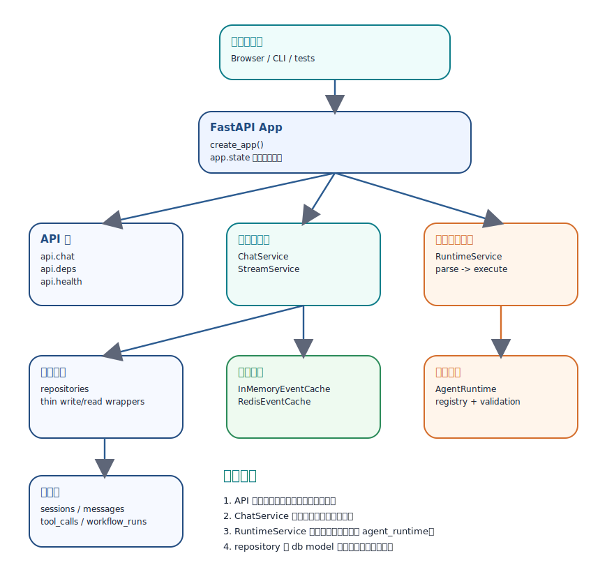
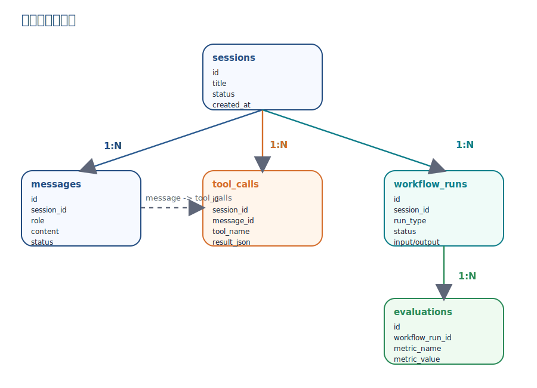

# agent_service 架构与分工关系教程

从宏观分层、职责边界、请求关系链到数据关系图的一份本地源码导读

- 范围：src/agent_service 与其依赖的 src/agent_runtime
- 产出：Markdown 教程 + PDF 图解版
- 生成日期：2026-03-13

## 一、宏观定位

agent_service 不是一个完整的 Agent 平台，而是建立在 agent_runtime 之上的服务外壳。它负责把 HTTP 请求、数据库事务、事件流、会话消息和工具执行结果组织成一个可运行、可持久化、可继续扩展的后端骨架。

如果从大图看，它做的是“应用壳层”的工作：对上接 FastAPI 与客户端协议，对下接数据库、缓存和 Phase 01 的执行内核；中间通过 ChatService 把一次聊天请求拼成一条完整的业务链路。

- 最外层是应用装配：`main.py` 负责启动、配置、数据库、运行时、缓存和路由挂载。
- 入口层是 API：`api/chat.py` 只处理 HTTP 形态、依赖注入和响应协议，不直接写业务细节。
- 中心层是服务编排：`ChatService` 统一掌控事务边界、会话落库、工具调用记录和回复组装。
- 编排层是 `OrchestratorService`：负责最小 agent loop，把规划、工具执行和 observation 回流串成完整闭环。
- 执行适配层是 `RuntimeService`：负责工具 schema、工具执行与 observation 生成。
- 底层是 repository + db models：把持久化细节从业务服务里抽离出来。
- 旁路是 `StreamService` + `EventCache`：负责把已经得到的完整响应拆成 SSE 事件流。

### 宏观分层图

## 二、模块分工与职责边界

- `config.py`：统一读取环境变量，把运行参数收敛成不可变 Settings 对象。
- `main.py`：应用启动装配点，创建 DatabaseManager、RuntimeService、OrchestratorService、EventCache，并把它们挂到 `app.state`。
- `api/deps.py`：把 `app.state` 中的共享对象转换成 FastAPI 可注入依赖；数据库 session 在这里按请求创建和释放。
- `api/chat.py`：两个接口入口。`POST /chat` 走普通 JSON 响应，`GET /chat/stream` 走 SSE 响应。
- `schemas/`：请求和响应的外部契约层，避免 API 直接暴露 ORM 或内部对象。
- `services/chat_service.py`：业务事务收口核心。它不是单纯调用 runtime，而是把会话、消息、workflow、llm_call、tool_call 和事务提交串在一起。
- `services/orchestrator_service.py`：Phase 03 的最小编排层。当前负责最小 agent loop，把 planner 决策和 RuntimeService 的工具执行串起来。
- `services/runtime_service.py`：执行层。当前负责暴露工具 schema、执行工具以及把工具结果转成 observation。
- `services/stream_service.py`：把一个完整的 `ChatResponse` 切分成 `start / message / tool_result / done` 事件。
- `services/cache_service.py`：定义 EventCache 协议，并提供内存版和 Redis 版实现。
- `repositories/`：薄仓储层，每个类只处理一张表的最小读写动作，提交权保留给上层 service。
- `db/models.py`：定义 session、message、tool_call、workflow_run、evaluation 五张核心表。
- `src/agent_runtime/`：真正的工具注册、参数校验、middleware 链和统一错误结果都在这里完成。

最关键的边界有两个。第一，API 层不拥有业务事务，事务在 ChatService 里统一提交或回滚；第二，ChatService 不关心 planner 和工具执行细节，它只依赖 RuntimeService 返回一个结构稳定的 AgentLoopExecution。

因此，这个架构不是“路由直接调数据库”，也不是“runtime 直接落库”。它通过服务层把应用协议、执行内核与持久化隔开，方便后续把演示工具替换成更复杂的 agent workflow。

## 三、`/chat` 主链路关系分析

`POST /api/v1/chat` 是当前 agent_service 的主干链路。它体现了这套骨架最重要的设计取向：先持久化上下文，再调用 runtime 的基础 agent loop，再把 planner/tool 结果回写到数据库，最后统一提交事务并返回结构化响应。

1. 请求先进入 `api.chat.create_chat_response`，FastAPI 负责把 JSON 解析成 `ChatRequest`。
2. `Depends(get_db_session)` 为这次请求创建一个数据库 session；`Depends(get_runtime_service)` 取出应用级 RuntimeService。
3. API 层只实例化 `ChatService` 并调用 `handle_chat(...)`，不处理持久化顺序和回滚。
4. ChatService 先确保 session 存在，再写入一条 user message，并创建状态为 `running` 的 workflow_run。
5. 随后它调用 `OrchestratorService.run(...)`，由编排层去驱动最小 planner loop。
6. 每一轮 loop 里，`OrchestratorService` 会先取 `RuntimeService` 暴露的 tool schema，再调用 `PlannerService.plan(...)` 取得结构化 `PlannerDecision`。
7. 如果 decision 是 `tool_call`，编排层会委托 `RuntimeService` 调用 `agent_runtime` 执行真实工具，并把结果转成 `ToolObservation` 进入下一轮；如果 decision 是 `respond`，loop 结束。
8. `agent_runtime` 仍然负责工具查找、Pydantic 参数校验、handler 调用、中间件日志和统一错误封装。
9. ChatService 根据 loop 结果统一写入 `llm_calls`、`tool_calls`、assistant message，并更新 workflow_run；中间任一异常都会触发 `rollback()`。

### `/chat` 请求关系链

- 这里的事务边界非常清晰：一次聊天请求对应一次数据库事务。
- 当前版本已经允许一条 user message 经过多轮 planner 决策后触发多次工具调用，只是整体仍然属于 Phase 03 的最小 loop 形态。
- reply 是给前端直接展示的人话，`tool_result` 是机器可读结构，两者并存。

## 四、`/chat/stream` 支链路关系分析

`GET /api/v1/chat/stream` 不是一条完全独立的业务链，而是在主链路之上增加了一个“输出协议转换层”。它先复用 ChatService 得到完整结果，再由 StreamService 把结果拆成 SSE 事件。

1. 入口仍在 `api/chat.py`，但参数来自 Query，而不是 JSON body。
2. 接口先把 `session_id` 和 `message` 重新装配成 `ChatRequest`，这样可以完整复用普通聊天逻辑。
3. ChatService 返回完整 `ChatResponse` 后，`StreamService.iter_events(...)` 才开始把响应拆成事件。
4. 事件顺序固定为：`start` -> `message` -> `tool_result`（可选）-> `done`。
5. 每发一条事件，都会把最后一条事件写入 EventCache；底层既可以是内存，也可以是 Redis。
6. 因此，当前 Phase 02 的 streaming 本质上是“后置拆包流”，还不是真正的 token-by-token 实时推理流。

### `/chat/stream` 输出链

## 五、数据关系与对象依赖关系

数据库层面，`sessions` 是顶层容器；`messages`、`tool_calls`、`workflow_runs` 都围绕 session 展开。这个设计把“对话容器”和“本次执行痕迹”区分开了，因此后续做回放、审计、评测和多步 workflow 都有落点。

### 核心数据关系图

- `sessions -> messages`：一条会话包含多条用户/助手消息。
- `sessions -> tool_calls`：同一会话里可能发生多次工具调用。
- `messages -> tool_calls`：一条消息可以触发零次或多次工具调用；当前实现通常是 0 或 1。
- `sessions -> workflow_runs`：每次业务执行都会留下一个工作流运行记录。
- `workflow_runs -> evaluations`：评测表还未进入主链路，但位置已预留给后续 Eval 体系。

代码依赖方向也很规整：API 依赖 schemas 与 services；ChatService 依赖 repositories 与 OrchestratorService；OrchestratorService 依赖 PlannerService 和 RuntimeService；RuntimeService 再向下依赖 agent_runtime；repositories 只依赖 db models。换句话说，越往下的层越稳定，越往上的层越贴近外部协议。

## 六、这套骨架的设计判断

- 优点一：职责切分清楚。HTTP、事务编排、执行内核、持久化、事件流各有单独位置。
- 优点二：扩展面明确。后续把 demo planner 升级成真实 LLM planner 时，主要改 `planner_service.py` 和 `services/planners/` 下的 provider client，而不必重写 API 或 repository。
- 优点三：可观测性已经预埋。workflow_runs、tool_calls、evaluation 表都在为未来的追踪与评测留钩子。
- 优点四：SSE、Redis、PostgreSQL 都有适配位，说明作者在搭一个可生长的后端壳，不是一次性 demo。
- 限制一：当前 planner 仍然是 demo 实现，离真实 provider 和真实 tool calling 还有距离。
- 限制二：streaming 目前不是实时流，而是完整结果生成后的事件拆分。
- 限制三：`build_event_cache()` 初始化 Redis 失败时会静默降级到内存缓存，可用性更高，但可观测性偏弱。
- 限制四：仓储层非常薄，适合当前阶段；如果业务规则继续增长，后续可能需要 query service 或 domain service 进一步分拆。

### 推荐阅读顺序

1. `src/agent_service/main.py`：先看应用是如何被装配起来的。
2. `src/agent_service/api/chat.py` 与 `api/deps.py`：理解入口层怎样拿到数据库和 runtime。
3. `src/agent_service/services/chat_service.py`：看事务怎样被统一收口。
4. `src/agent_service/services/orchestrator_service.py`：看 agent loop 怎样把规划和执行串起来。
5. `src/agent_service/services/runtime_service.py`：看工具 schema、工具执行与 observation 怎样被封装。
6. `src/agent_service/services/planner_service.py` + `services/planners/`：看 prompt、retry、timeout 和 provider client 是怎样解耦的。
7. `src/agent_runtime/runtime.py`、`registry.py`、`errors.py`：理解真正的执行内核。
8. `src/agent_service/repositories/` + `db/models.py`：最后再看持久化和数据结构。

一句话总结：agent_service 的价值，不在于它已经实现了多强的 agent，而在于它已经把“以后怎么长成真正的平台”这件事，用一套分层清楚、关系明确的骨架提前铺好了。
